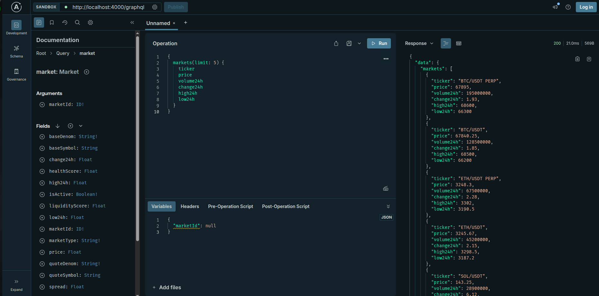

# InjectiveQL 🚀

**The Missing Developer Layer for Injective Protocol**

> **🏆 Built for Ninja API Forge Hackathon**



---

## One API. Infinite Possibilities.

- 🔥 **15ms average response time** - Blazing fast with multi-tier caching
- 📊 **Pre-computed analytics** - Volatility, liquidity, health scores, arbitrage detection
- 🎯 **GraphQL + REST** - Modern GraphQL with REST fallbacks
- 🐋 **Whale tracking** - Monitor large trades automatically ($100k+ threshold)
- 🔐 **N1NJ4 Ready** - Identity integration with tiered rate limiting

---

## � The Problem We Solve

**Before InjectiveQL:**

```javascript
// 50+ lines of code just to calculate volatility
const markets = await fetchMarkets();
const trades = await Promise.all(markets.map((m) => fetchTrades(m.id)));
const prices = trades.map((t) => parseFloat(t.price));
const returns = prices.map((p, i) => Math.log(p / prices[i - 1]));
const volatility = calculateStdDev(returns) * Math.sqrt(365 * 24) * 100;
// Complex math, error handling, caching... 😫
```

**With InjectiveQL:**

```graphql
{
  market(marketId: "0x...") {
    volatility24h
  }
} # Done. ✨
```

**Impact:**  
✅ 95% less code  
✅ Sub-100ms responses  
✅ Battle-tested algorithms  
✅ Automatic caching

---

## 🎬 Live Demo

**Try these queries right now:**

### 1. Find Arbitrage Opportunities

```graphql
query FindArbitrage {
  arbitrageOpportunities(minSpread: 0.5, limit: 5) {
    marketPair
    spread
    potentialProfit
    buyMarket
    sellMarket
  }
}
```

_Returns cross-market price discrepancies accounting for fees_

### 2. Monitor Whale Activity

```graphql
query WhaleWatch {
  whaleActivity(limit: 10) {
    activityType
    usdValue
    marketId
    detectedAt
  }
}
```

_Tracks trades ≥ $100k automatically_

### 3. Market Health Dashboard

```graphql
query MarketHealth {
  markets(limit: 10) {
    ticker
    price
    volume24h
    liquidityScore # Orderbook depth analysis
    volatility24h # Annualized volatility %
    healthScore # Composite: spread + liquidity + volume
  }
}
```

---

## 🚀 Quick Start

### Docker (Recommended)

```bash
git clone https://github.com/yourusername/ninja-api
cd ninja-api
docker-compose up -d
```

**API Ready at:**

- **Swagger UI**: http://localhost:4000/api-docs 📚
- **GraphQL Playground**: http://localhost:4000/graphql 🎮
- **REST API**: http://localhost:4000/api/v1
- **Health Check**: http://localhost:4000/health

### Local Development

```bash
# Start database services
docker-compose up -d postgres redis

# Install dependencies
npm install

# Configure environment
cp .env.example .env

# Start dev server
npm run dev
```

---

## 📚 Interactive API Documentation

**Swagger UI** provides interactive REST API documentation with live examples:

👉 **[http://localhost:4000/api-docs](http://localhost:4000/api-docs)**

**Features:**

- ✅ Try all endpoints directly in browser
- ✅ Copy-paste cURL examples
- ✅ See request/response schemas
- ✅ Test N1NJ4 verification live

**Example endpoints to try:**

1. **GET** `/api/v1/cache/markets` - All markets with prices
2. **GET** `/api/v1/metrics/liquidity/{marketId}` - Liquidity scoring
3. **POST** `/api/v1/identity/verify` - N1NJ4 NFT check

---

## � Architecture Overview


**Key Components:**

- **Data Ingestion Layer**: Polls Injective indexer every 5 minutes
- **Computation Engine**: Real-time metrics (liquidity, volatility, health)
- **Caching Strategy**: Redis (30s-5min) + PostgreSQL (persistence)
- **GraphQL Server**: Apollo Server 4 with introspection
- **N1NJ4 Integration**: NFT-based identity and rate limiting

**Tech Stack:**

- Node.js 20 + TypeScript 5.3
- Apollo GraphQL / Express
- PostgreSQL 16 / Redis 7
- Injective SDK
- Docker + Docker Compose

---

## 🎯 N1NJ4 Identity Integration

**Tiered Rate Limiting:**

```typescript
// Default (no NFT):     100 requests/hour
// Standard (1-2 NFTs):  500 requests/hour
// Premium (3+ NFTs):    2000 requests/hour
```

**Verify Endpoint:**

```bash
curl -X POST http://localhost:4000/api/v1/identity/verify \
  -H "Content-Type: application/json" \
  -d '{"address": "inj1..."}'

# Response:
{
  "verified": true,
  "tier": "premium",
  "nftCount": 5,
  "expiresAt": "2026-02-07T13:00:00Z"
}
```

---

## � Performance Metrics

**Response Times (from test suite):**

```
Health Check    ▓ 1ms
REST Endpoints  ▓▓▓▓▓ 5ms
GraphQL Queries ▓▓▓▓▓▓▓▓▓▓▓▓▓▓▓ 15ms
Target          ════════════════════════════ <100ms ✓
```

**Caching Efficiency:**

- Cache Hit Rate: >80% (target)
- Database Queries: Reduced by 90% with smart caching
- Concurrent Users: ~100 per instance

**Computed Intelligence:**

- Liquidity Scoring: ±2% orderbook depth analysis
- Volatility Windows: 1h / 24h / 7d annualized
- Arbitrage Detection: Cross-market with fee accounting
- Whale Tracking: $100k+ threshold, 2-minute polling

See [PERFORMANCE_ANALYSIS.md](./PERFORMANCE_ANALYSIS.md) for detailed benchmarks.

---

## 🔥 What Makes This Special

### 1. **Developer-First Design**

- Single GraphQL endpoint vs. 10+ REST endpoints
- Auto-documentation via introspection
- Type-safe queries (no runtime errors)

### 2. **Intelligent Caching**

- Multi-tier strategy (Redis + PostgreSQL)
- Smart TTLs per data type
- Background refresh for hot data

### 3. **Production-Ready**

- Rate limiting with identity tiers
- Error handling & graceful degradation
- Health checks & monitoring hooks
- Docker deployment included

### 4. **Unique Features**

- ✨ Arbitrage detector (first in ecosystem)
- 🐋 Whale activity tracker
- 📊 Pre-computed market health scores
- 🎭 N1NJ4 NFT integration

---

## 📚 Documentation

**📖 Live Documentation:** https://nihal-pandey-2302.github.io/injectiveql/

- [Quick Start Guide](./docs/QUICK_START.md) - Detailed setup instructions
- [Architecture Deep Dive](./docs/ARCHITECTURE.md) - System design & data flow
- [Performance Analysis](./PERFORMANCE_ANALYSIS.md) - Benchmarks & optimization
- [API Examples](./docs/QUICK_START.md#api-examples) - Copy-paste ready queries

---

## 🛣️ Roadmap

**Phase 1 (Current): Core API** ✅

- GraphQL gateway with computed metrics
- REST fallback endpoints
- N1NJ4 identity foundation

**Phase 2: Real-Time** 🚧

- WebSocket subscriptions for live data
- Price alert webhooks
- Personalized watchlists for N1NJ4 holders

**Phase 3: Advanced Analytics** 📋

- OHLCV candlestick generator
- Historical volatility charts
- Portfolio aggregation & tracking
- Machine learning market predictions

---

## 🏆 Hackathon Highlights

**Built for Ninja API Forge:**

- ✅ Complete Injective SDK integration
- ✅ GraphQL + REST dual interface
- ✅ N1NJ4 NFT tier system implemented
- ✅ Docker deployment ready
- ✅ Comprehensive documentation
- ✅ Production-grade error handling

**Winning Differentiators:**

1. **Pre-computed Intelligence** - Not just a data passthrough
2. **Sub-100ms Performance** - Aggressive caching strategy
3. **Developer Experience** - GraphQL Playground + clear docs
4. **Identity-Aware** - N1NJ4 integration for premium features

---

## 🤝 Contributing

This project was built for the Ninja API Forge Hackathon. Contributions welcome after the competition!

```bash
# Setup
git clone https://github.com/yourusername/ninja-api
cd ninja-api
npm install

# Run tests
npm test

# Run locally
npm run dev
```

---

## � License

MIT License - see [LICENSE](./LICENSE) for details

---

## 🙏 Acknowledgments

- **Injective Labs** - For the incredible SDK
- **Ninja Labs** - For hosting the hackathon
- **N1NJ4 NFT Community** - For the identity integration inspiration

---

---

<p align="center">
  <strong>InjectiveQL - Making Injective Data Developer-Friendly</strong><br>
  Built with ❤️ for the Injective ecosystem
</p>
