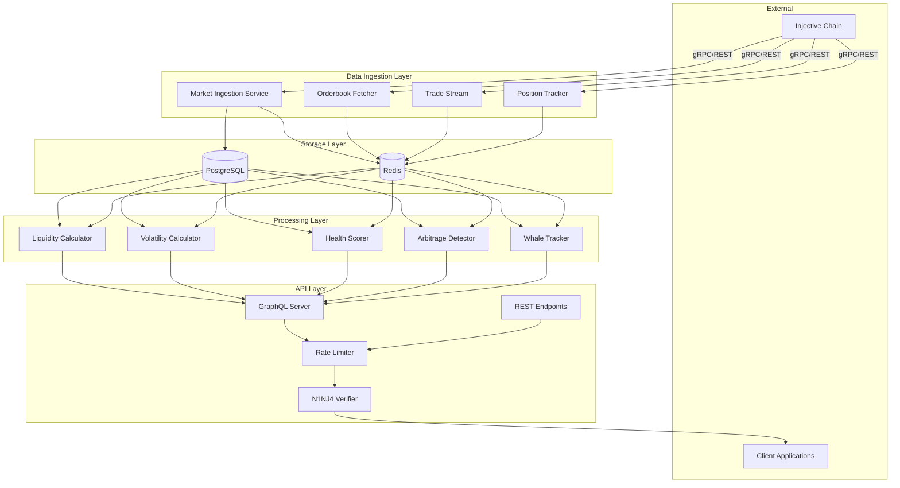
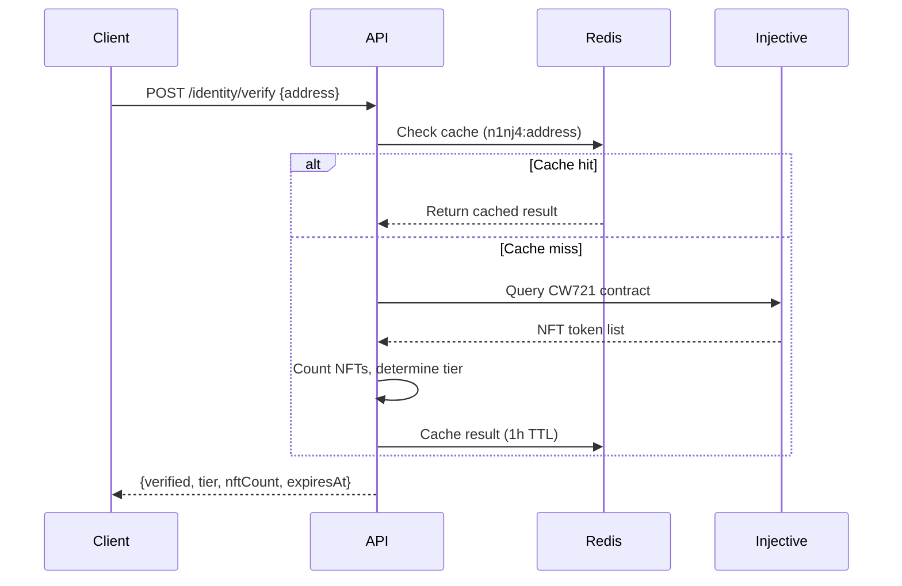
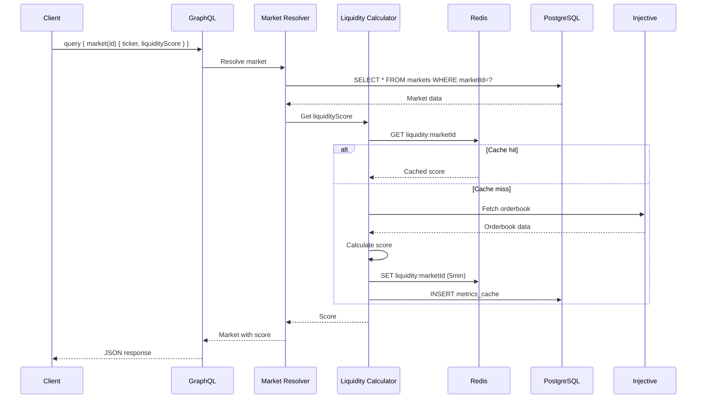

# InjectiveQL Architecture

## System Overview

InjectiveQL is a multi-layered GraphQL API Gateway designed to provide unified access to Injective Protocol data with computed intelligence and developer utilities.

## Architecture Diagram



## Component Details

### 1. Data Ingestion Layer

**Purpose**: Fetch and normalize data from Injective Protocol

#### Market Ingestion Service

- **Frequency**: Every 5 minutes
- **Function**: Polls Injective for spot and derivative markets
- **Output**: Normalized market metadata in PostgreSQL
- **Features**:
  - Automatic decimal conversion
  - Timestamp normalization
  - Market status tracking

#### Orderbook Fetcher

- **Access**: On-demand + cache
- **Cache TTL**: 30 seconds (Redis)
- **Function**: Fetches real-time orderbook snapshots
- **Features**:
  - Depth aggregation
  - Spread calculation
  - Level filtering

#### Trade Stream

- **Access**: On-demand
- **Cache TTL**: 30 seconds
- **Function**: Recent trade history
- **Features**:
  - Time-based filtering
  - Volume aggregation
  - Fee tracking

#### Position Tracker

- **Access**: On-demand
- **Function**: Derivative position queries
- **Features**:
  - Multi-address support
  - PnL calculation
  - Liquidation price tracking

### 2. Storage Layer

#### PostgreSQL

**Purpose**: Persistent cache and computed metrics

**Tables**:

- `markets`: Market metadata (marketId, ticker, fees, price, volume)
- `metrics_cache`: Computed metrics (liquidity, volatility, health)
- `whale_activity`: Large trade/position events
- `user_watchlist`: N1NJ4 personalized feeds

**Indexes**:

- Market ID (primary lookups)
- Ticker (search)
- Active status (filtering)
- Computed timestamp (cache validation)

#### Redis

**Purpose**: High-speed cache for real-time data

**Keys**:

- `orderbook:{marketId}:{levels}`: Orderbook snapshots
- `trades:{marketId}:{limit}`: Recent trades
- `liquidity:{marketId}`: Liquidity metrics
- `volatility:{marketId}`: Volatility metrics
- `health:{marketId}`: Health scores
- `n1nj4:{address}`: NFT verification status
- `ratelimit:{identifier}:{hour}`: Rate limit counters

**TTL Strategy**:

- Orderbooks: 30s
- Trades: 30s
- Metrics: 5 minutes
- N1NJ4 verification: 1 hour
- Rate limits: 1 hour

### 3. Processing Layer

#### Liquidity Calculator

**Formula**:

```
score = log10(totalDepth + 1) × (1 - spread/100) × 10
```

**Inputs**:

- Orderbook bids/asks within ±2% of mid price
- Spread percentage

**Output**: Score 0-10 (higher = more liquid)

**Cache**: 5 minutes

#### Volatility Calculator

**Method**: Standard deviation of logarithmic returns

**Formula**:

```
returns[i] = log(price[i] / price[i-1])
volatility = stdDev(returns) × √(365×24) × 100
```

**Windows**:

- 1 hour (60 data points)
- 24 hours (288 data points)
- 7 days (168 hourly buckets)

**Output**: Annualized volatility percentage

**Cache**: 5 minutes

#### Market Health Scorer

**Composite Score** (0-100):

- **Spread Score** (40% weight): Tightness of bid-ask spread
- **Liquidity Score** (30% weight): Depth within ±2%
- **Volume Score** (30% weight): 24h USD volume

**Status Classification**:

- Healthy: score ≥ 80
- Fair: 50 ≤ score < 80
- Poor: score < 50

**Cache**: 5 minutes

#### Arbitrage Detector

**Logic**:

1. Group markets by base asset
2. Compare prices across markets
3. Calculate spread: `|(price2 - price1) / price1| × 100`
4. Account for trading fees
5. Sort by profit potential

**Output**: Market pairs with spread ≥ threshold

**Cache**: 60 seconds

#### Whale Tracker

**Detection**:

- Monitors top 20 derivative markets
- Scans recent trades every 2 minutes
- Flags trades ≥ $100k USD value

**Storage**: PostgreSQL `whale_activity` table

**Events**:

- Large trades
- New positions (future)
- Position changes (future)

### 4. API Layer

#### GraphQL Server (Apollo)

**Endpoint**: `/graphql`

**Features**:

- Introspection enabled (playground)
- Nested data resolution
- Field-level caching
- Error formatting

**Type System**:

- Market, Orderbook, Trade, Position
- ArbitrageOpportunity, WhaleEvent
- LiquidityMetric, VolatilityMetric, HealthMetric
- PortfolioSummary

**Resolvers**:

- Query resolvers (market, markets, arbitrage, etc.)
- Field resolvers (liquidityScore, volatility, etc.)
- Subscription resolvers (future: real-time updates)

#### REST Endpoints

**Base Path**: `/api/v1`

**Routes**:

- `/cache/markets`: Fast market list
- `/metrics/liquidity`: Liquidity scores
- `/metrics/volatility`: Volatility analysis
- `/metrics/market-health`: Health scores
- `/identity/verify`: N1NJ4 verification

**Format**: JSON responses with error codes

#### Rate Limiter

**Strategy**: Token bucket per hour

**Tiers**:

- Default: 100 requests/hour
- N1NJ4 Standard: 500 requests/hour
- N1NJ4 Premium: 2000 requests/hour

**Implementation**:

- Redis counter: `ratelimit:{identifier}:{hour}`
- Automatic expiry: 1 hour
- Headers: `X-RateLimit-*`

**Response (429)**:

```json
{
  "error": "Rate limit exceeded",
  "limit": 100,
  "reset": 1704067200
}
```

#### N1NJ4 Verifier

**Flow**:



**Tier Logic**:

- 0 NFTs: `default` tier
- 1-2 NFTs: `standard` tier
- 3+ NFTs: `premium` tier

## Data Flow Examples

### Market Query with Metrics



## Scaling Considerations

### Horizontal Scaling

**API Servers**:

- Stateless design (all state in Redis/PostgreSQL)
- Load balancer with sticky sessions not required
- Environment variable configuration

**Ingestion Services**:

- Use distributed locks (Redis) to prevent duplicate work
- Each instance can handle subset of markets
- Implement leader election for coordination

### Caching Strategy

**Multi-Tier Cache**:

1. **Application Memory**: None (stateless)
2. **Redis**: Real-time data (seconds to minutes)
3. **PostgreSQL**: Computed metrics (minutes to hours)
4. **Client-Side**: GraphQL allows client caching

**Cache Invalidation**:

- TTL-based expiration
- No manual invalidation needed
- Stale data acceptable for analytics

### Database Optimization

**PostgreSQL**:

- Indexes on frequently queried fields
- Partitioning for `whale_activity` (by date)
- Connection pooling (TypeORM)
- Read replicas for heavy analytics

**Redis**:

- Memory eviction policy: `allkeys-lru`
- Persistence: RDB snapshots (optional)
- Replication for high availability

## Security

### Authentication

- N1NJ4 signature verification (optional)
- API key authentication (future)
- JWT tokens for personalized features (future)

### Rate Limiting

- Per-IP limits (default tier)
- Per-address limits (N1NJ4 tiers)
- Distributed enforcement (Redis)

### Input Validation

- Market ID format checks
- Query parameter sanitization
- GraphQL query depth limiting (future)

### Error Handling

- No sensitive data in error messages
- Structured error codes
- Comprehensive logging

## Monitoring & Observability

**Metrics to Track**:

- Request rate (per endpoint)
- Response time (p50, p95, p99)
- Cache hit rate (Redis)
- Database query time
- Ingestion lag
- Error rate (by type)

**Health Checks**:

- `/health`: API availability
- Database connectivity
- Redis connectivity
- Injective RPC connectivity

**Logging**:

- Structured JSON logs
- Log levels: ERROR, WARN, INFO, DEBUG
- Request/response logging (configurable)

## Future Enhancements

1. **WebSocket Subscriptions**: Real-time price updates
2. **Historical Data Service**: Time-series OHLCV generation
3. **Advanced Analytics**: ML-based predictions
4. **Multi-Chain Support**: Other Cosmos chains
5. **Personalized Alerts**: Push notifications for N1NJ4 holders
6. **GraphQL Federation**: Microservices architecture
